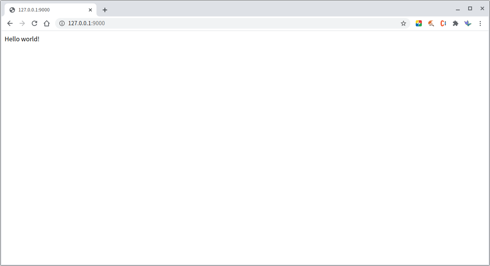

## 1. 安装
安装完毕 `nodejs` 环境后，在项目根目录中执行
```
npm install
```
即可安装 `mircore` 到本地。

## 1.1. 依赖

mircore 的依赖如下

| 包名 | 版本号 | 说明 |
| --- | --- | --- |
|cache | ^2.3.1 | |
|cookie | 0.4.0 | |
|coralian | 0.0.25 | |
|imageinfo | ^1.0.4 | |
|merge-descriptors | ^1.0.1 | |
|nodemailer | ^6.6.3 | |

## 2. 项目

## 2.1. 项目结构
从项目根目录来看，程序的基本结构如下：
```
index.js
package.json
./src/
./res/
    json/
        app.json
```

## 2.1.1. index.js
`index.js` 是程序的入口文件。
在这里只要引入 `mircore`，并启动服务即可。
```
const server = require("mircore");
server.start();
```

## 2.1.2. package.json
nodejs 的程序配置，不多做解释。

## 2.1.3. res 文件夹
这里是所有资源文件的配置。  
程序启动时，这里配置一个 json 文件夹，配置程序所必需的配置项目。  

具体说明参考 **[2.2. 程序配置](#22-程序配置)**

## 2.2.4. src 文件夹
这里是程序的代码文件。

具体说明参考 **[2.3. 第一个程序](#23-第一个程序)**

## 2.2. 程序配置
程序所有的配置都在 `/res/json/app.json` 这个文件里。 

**这些配置都由 mircore 来实现，不用开发者自己写代码来调用**。

## 2.2.1. 端口号
开发模式的配置名是 `port` ，如果不配置，默认使用 `9000` 。

启动程序后，可以通过 `http://localhost:9000` 来访问网站。

## 2.2.2. 参数分割符
参数分割符的配置名是 `split-mark` ，如果不配置，默认使用`:`。

mircore 支持在 url 中带参数，形式如下： `/controller/action/parameters` 。  
暂时先关注最后的 `parameters` 。这部分可以由多个参数构成，所以需要一个分割符来区分不同的参数：`/controller/action/p1:p2:p3`。
关于 mircore 的 url 说明，可以参考 **[2.4. url](#24-url)**

## 2.2.3. 开发模式
开发模式的配置名是 `develop-mode` ，如果不配置，默认使用 `true`（开发模式）。

开发模式可以用于判断当前程序是处于开发状态还是生产状态。

## 2.2.4. 程序名称
程序名称的配置名是 `app-name` 。如果配配置，则不会有程序名。

## 2.2.5. 路由
程序名称的配置名是 `routes` 。

路由的配置是一个 `key-value` 结构。  
`key` 是浏览器中的访问路径，`value` 是程序对应的程序模块（文件夹）。  
`key`、`value` 之间是多对一的关系，也即同一个程序模块可以有多个不同的入口。  
`key` 中只配置 `controller`，而不要把 `action` 也写入配置。  
`key` 作用于浏览器中，所以可以和实际的模块名（value）不一致。

## 2.2.6. 完整的示例
```
{
	"port": 9000,
	"split-mark | :",
	"develop-mode": true,
	"app-name | mircore-demo",
	"routes": {
		"/index | /homepage"
	}
}
```

## 2.3. 第一个程序
所有的程序代码都放在 `src` 文件夹中。

在 `src` 文件夹中新建 `modules` 文件夹存放所有模块的代码文件。  
然后在 `modules` 文件夹中新建一个 `homepage` 文件夹，这个 `homepage` 就代表了一个模块。

在 `app.json` 中的 `routes` 配置中添加一条配置：
```
routes: {
    "/index | /homepage"
}
```
这样，模块和 浏览器url 之间的对应关系就建立好了。然后在 `homepage` 文件夹中新建一个叫 `controller.js` 的文件。  
**不要随意修改 `controller.js` 的文件名，否则 mircore 将无法识别**。

然后在 `controller.js` 中写下面的代码，一个最简单的网站就建好了，可以通过浏览器访问了。
```
const controller = require("mircore").controller;

function indexController() {

	const ctrler = controller();

	ctrler.addAction(() => {
		ctrler.render("Hello world!");
	});

	return ctrler;
}

module.exports = exports = indexController;
```
>
>图1 Hello world

## 2.3.1. 渲染
在上述示例中，采用了直接将文本渲染到前端页面中的方式。  
在 mircore 中，也可以采用模板化处理来渲染一个 HTML 文件。  
此时，就需要先引入一个 HTML 文件，这个文件的位置从项目根目录开始。
```
const page = '/res/html/homepage.html'
```

再将上面的 controller 代码修改为：
```
const controller = require("mircore").controller;

function indexController() {

	const ctrler = controller();

	ctrler.addAction(() => {
		ctrler.render(page); // 这里表示通过文件渲染
	});

	return ctrler;
}

module.exports = exports = indexController;
```

而对应的 HTML 文件中则是：
```
<!DOCTYPE html>
<html lang="zh-CN">
<head>
<meta charset="UTF-8" />
<title></title>
</head>
<body>
<p>Hello world!</p>
</body>
</html>
```
就可以获得和 图1 相同的效果。

因为采用了模板，所以也可以将变量放置到页面中去。
```
const controller = require("mircore").controller;

function indexController() {

	const ctrler = controller();

	ctrler.addAction(() => {
        ctrler.setAttr("tpl_val", "Hello world!");
		ctrler.render(page);
	});

	return ctrler;
}

module.exports = exports = indexController;
```
HTML 文件修改为：
```
<!DOCTYPE html>
<html lang="zh-CN">
<head>
<meta charset="UTF-8" />
<title></title>
</head>
<body>
<p>${tpl_val}</p>
</body>
</html>
```
同样可以获得和 图1 相同的效果。

模板的更多配置可以参考：[页面模板](./page-template.md)

## 2.3.1.1. 渲染方式

## 2.3.1.1.1. render
mircore 默认的渲染方式，只用于 HTML 的渲染。

## 2.3.1.1.2. plain
用于渲染 text/plain 形式的渲染。
如果指定渲染类型，则可以渲染相对应的内容。

## 2.3.1.1.3. renderJSON
用于渲染 application/json 形式的渲染。

## 2.4 url
mircore 把 url 分成了四段。一个完整的 url 应该类似下面的结构：
`/controller/action/parametes?queries`

## 2.4.1. controller
因为模块可以组织成结构，所以 controller 支持多层形式
比如一个模块组织为如下形式：
```
/client/
    /local
	/cloud
```
在这种情况下，client 模块有两种处理逻辑：本地处理和云端处理。  
而这两个模块的逻辑可能会不太一样，所以分成了两个子模块。  

这样做的好处是可以将类似的代码组织在一起，而浏览器访问的时候，通过配置，可以少一层 router：
```
routes: {
    "/local | /client/local"
    "/cloud | /client/cloud"
}
```
当然，写成下面这样也完全没有问题。
```
routes: {
    "/client/local | /client/local"
    "/client/cloud | /client/cloud"
}
```

上面实现的代码就是一个 controller 。
```
const controller = require("mircore").controller;

function indexController() {

	const ctrler = controller();

	ctrler.addAction(() => {
		ctrler.render("Hello world!");
	});

	return ctrler;
}

module.exports = exports = indexController;
```

所有 controller 类必需通过 xxxController 这个函数来实现，前面的 xxx 可以自定义修改。

## 2.4.1.1. index
当 controler 为 index 的时候，只有当访问首页，也即 url 中值有域名和 queies 的时候可以省略 index 。
示例：
```
http://127.0.0.1/
http://127.0.0.1/?abc=123
```

## 2.4.2. action
url 的第二段是 action ，对应的是各个模块中所会产生的动作或者要获得的内容形式。
action 对应的是 controller 中的方法。

在上面的代码中，就通过 `ctrler.addAction` 来加载了一个 action。
```
const controller = require("mircore").controller;

function indexController() {

	const ctrler = controller();

	ctrler.addAction(() => {
        ctrler.setAttr("tpl_val", "Hello world!");
		ctrler.render(page);
	});

	return ctrler;
}

module.exports = exports = indexController;
```

action 可以是一个普通的函数，也可以是一个类。  
mircore 提供了两个 action 的基类： baseAction、ajaxAction。

## 2.4.2.1. baseAction
baseAction 是所有 action 的基类。

引入方式：
```
const baseAction = require("mircore").baseAction;
```
创建实例：
```
function indexAction() {
	const action = baseAction();
	action.execute = function() {
	};
	return action;
}
```
所有 action 类必需通过 xxxAction 这个函数来实现，前面的 xxx 可以自定义修改。

baseAction 是一个抽象类，所以所有继承 baseAction 的类都要自行实现 `execute` 方法。

## 2.4.2.2. ajaxAction
ajaxAction 是 baseAction 的子类，是专门用于渲染 ajax 请求的类。

引入方式：
```
const ajaxAction = require("mircore").ajaxAction;
```
创建实例：
```
function indexAction() {
	const action = ajaxAction();
	action.query = function() {
	};
	return action;
}
```
ajaxAction 继承自 baseAction，所以已经实现 `execute` 方法。  
ajaxAction 是一个抽象类，所以所有继承 ajaxAction 的类都要自行实现 `query` 方法。  
ajaxAction 重载了一个 renderAjax 的方法，默认的渲染方式时 JSON 。  
如果需要实现其他形式的渲染，需要调用 controller 中其他的渲染方式来实现。

## 2.4.2.3. 将 action 添加到 controller
## 2.4.2.3.1. 用匿名函数作为 action
就如值前示例的：
```
ctrler.addAction(() => {
});
```
通过这种方式加载的 action，所对应的 url 就是 index 。

## 2.4.2.3.2. 通过命名函数作为 action
```
function xxxAction() {
	const action = baseAction() {
	}
	return action;
}
```
如果有以上代码，则可以直接添加 `xxxAction` 作为 action 。
```
ctrler.addAction(xxxAction);
```
通过这种方式加载的 action ，所对应的 url 就是 xxx 。

## 2.4.2.3.3. 通过指定 action 名来添加 action
```
ctrler.addAction("abc", xxxAction);
```
上面的代码虽然同样是添加了 xxxAction，但因为多了一个参数”aaa“，所以这时候 action 的名称已经被指定为”aaa“。  
在浏览器中就无法通过 `xxx` 来访问，只能通过 `abc` 来访问了。

## 2.4.2.4. 请求方法
mircore 支持 RESTFul 形式的请求，在添加 action 时，可以指定请求方法，如：
```
ctrler.addAction("abc", xxxAction, "POST");
```
如果不指定，默认为 `GET` 方法。

## 2.4.2.5. index
当 action 为 index 的时候，url 中可以省略 index 。
示例：
```
http://127.0.0.1/controller/
```

## 2.4.3 paramters

## 2.4.4. queries