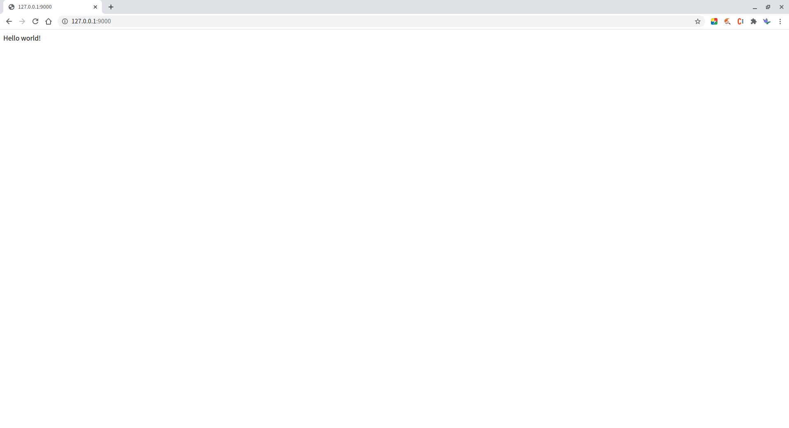

# 1. 安装
安装完毕 `nodejs` 环境后，在项目根目录中执行
```
npm install
```
即可安装 `mircore` 到本地。

# 2. 项目
## 2.1. 项目结构
从项目根目录来看，程序的基本结构如下：
```
index.js
package.json
./src/
./res/
    json/
        app.json
```

## 2.1.1. index.js
`index.js` 是程序的入口文件。
在这里只要引入 `mircore`，并启动服务即可。
```
const server = require("mircore");
server.start();
```

## 2.1.2. package.json
nodejs 的程序配置，不多做解释。

## 2.1.3. res 文件夹
这里是所有资源文件的配置。  
程序启动时，这里配置一个 json 文件夹，配置程序所必需的配置项目。  

具体说明参考 **[2.2. 程序配置](#22-程序配置)**

## 2.1.4. src 文件夹
这里是程序的代码文件。

具体说明参考 **[2.3. 第一个程序](#23-第一个程序)**

## 2.2. 程序配置
程序所有的配置都方在 `/res/json/app.json` 这个文件里。 

**这些配置都由 mircore 来实现，不用开发者自己写代码来调用**。

### 2.2.1. 端口号
开发模式的配置名是 `port` ，如果不配置，默认使用 `9000` 。

启动程序后，可以通过 `http://localhost:9000` 来访问网站。

### 2.2.2. 参数分割符
参数分割符的配置名是 `split-mark` ，如果不配置，默认使用`:`。

mircore 支持在 url 中带参数，形式如下： `/controller/action/parameters` 。  
暂时先关注最后的 `parameters` 。这部分可以由多个参数构成，所以需要一个分割符来区分不同的参数：`/controller/action/p1:p2:p3`。
关于 mircore 的 url 说明，可以参考[2.3.2. url](#232-url)

### 2.2.3. 开发模式
开发模式的配置名是 `develop-mode` ，如果不配置，默认使用 `true`（开发模式）。

开发模式可以用于判断当前程序是处于开发状态还是生产状态。

### 2.2.4. 程序名称
程序名称的配置名是 `app-name` 。如果配配置，则不会有程序名。

### 2.2.5. 路由
程序名称的配置名是 `routes` 。

路由的配置是一个 `key-value` 结构。  
`key` 是浏览器中的访问路径，`value` 是程序对应的程序模块（文件夹）。  
`key`、`value` 之间是多对一的关系，也即同一个程序模块可以有多个不同的入口。  
`key` 中只配置 `controller`，而不要把 `action` 也写入配置。  
`key` 作用于浏览器中，所以可以和实际的模块名（value）不一致。


## 2.3. 第一个程序
所有的程序代码都放在 `src` 文件夹中。

在 `src` 文件夹中新建 `modules` 文件夹存放所有模块的代码文件。  
然后在 `modules` 文件夹中新建一个 `homepage` 文件夹，这个 `homepage` 就代表了一个模块。

在 `app.json` 中的 `routes` 配置中添加一条配置：
```
routes: {
    /index: /homepage
}
```
这样，模块和 浏览器url 之间的对应关系就建立好了。然后在 `homepage` 文件夹中新建一个叫 `controller.js` 的文件。  
**不要随意修改 `controller.js` 的文件名，否则 mircore 将无法识别**。

然后在 `controller.js` 中写下面的代码，一个最简单的网站就建好了，可以通过浏览器访问了。
```
const controller = mircore.controller;

function indexController() {

	const ctrler = controller();

	ctrler.addAction(() => {
		ctrler.render("Hello world!");
	});

	return ctrler;
}

module.exports = exports = indexController;
```



### 2.3.1 渲染
在上述

### 2.4 url
mircore 把 url 分成了四段。一个完整的 url 应该类似下面的结构：
`/controller/action/parametes?queries`

#### 2.4.1. controller